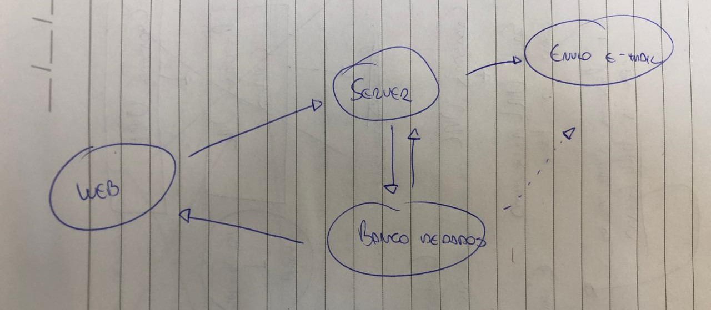

# Clincker (Web)
🔗 URL Shortener in an easy and quick way.

## Sobre

Hoje em dia, um link pode desde redirecionar para alguma página da web, até mesmo fazer um negócio ser achado ou não por clientes. Sendo assim, a relevância desse meio é muito importante.

E foi para atender essa demanda que uma solução simples e eficaz surgiu, o Clincker.

## Conceito

O principal objetivo é proporcionar uma sequência de rotas e recursos para que o cadastramento das URLs e validação delas seja feita com maestria.

Então após cadastrar as URLs, o usuário terá também recurso para obter informações mais detalhadas e também validação dos _hashes_ criados no processamento.

### Escopo

O fluxo se resume ao cadastro de usuário ou então login. Com o resultado dessas rotas, ocorre o usuário que poderá então cadastrar quantas URLs desejar.

Essas URLs estarão registradas no banco de dados, juntamente com o código aleatório que foi gerado para ela. Um mesmo usuário poderá encurtar quantas URLs quiser, tendo também uma interface de compartilhamento e análise de dados de acesso.

Então pode ser resumido a cadastro, análise de acesso e também comportamento de envio de e-mails, seja para confirmação de cadastro, seja para compartilhamento ou também o que for desejado.

## Tecnologias

Para construir esse serviço, será usada **Golang**, que vai proporcionar velocidade e praticidade. Além disso, a aplicação será composta por um conjunto de serviços, sendo então essa API e também envio de e-mail.

Ao redor disso, será usado também um banco de dados **MySQL/MariaDB**, que proporciona uma forma prática e performática de guardar os dados e realizar as consultas de _hash_.
